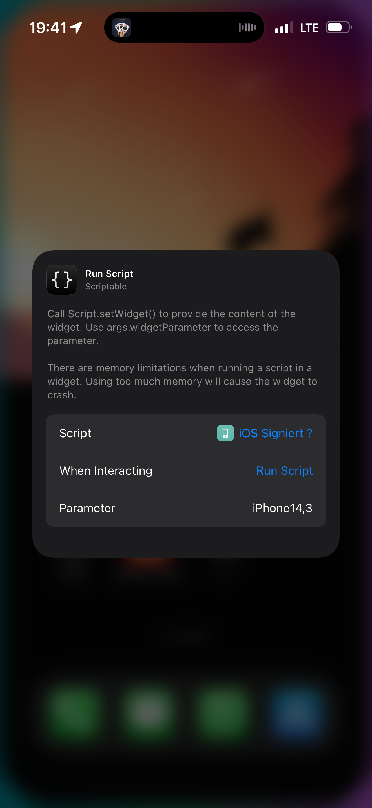
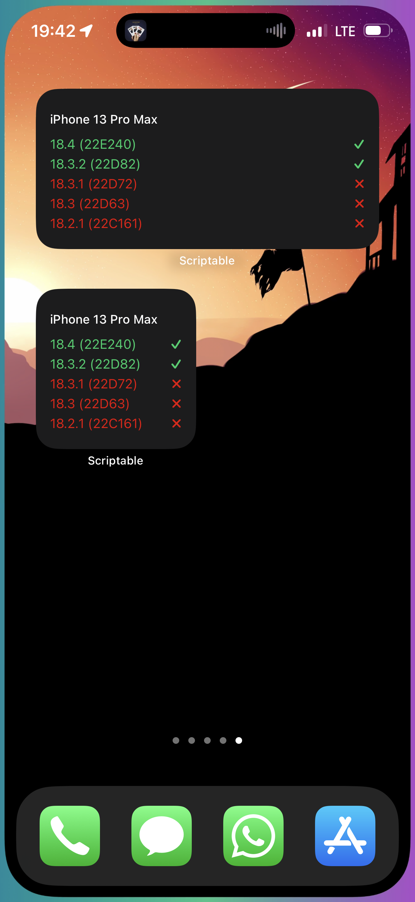

# iOS-Signing-Status-Widget
This **Scriptable** widget allows you to check the firmware signing status of your Apple devices. It fetches the latest iOS, iPadOS, and tvOS firmware information and displays whether they are still signed by Apple.

## Features
- Displays the latest firmware versions and build numbers.
- Shows whether a firmware is signed (✓) or unsigned (✗).
- Supports various Apple devices, including iPhones, iPads, and Apple TVs.
- Customizable device selection using **Widget Parameter**.

## Installation
1. Download and install **Scriptable** from the [App Store](https://apps.apple.com/de/app/scriptable/id1405459188).
2. Copy and paste the script into a new Scriptable script.
3. Set your **Widget Parameter** to your device's identifier (see below).

## Finding Your Device Identifier
To find your Apple device model identifier, use the app **MacTracker**, available on the [App Store](https://apps.apple.com/de/app/mactracker/id311421597).

## How to Use
1. Add a new **Scriptable widget** to your home screen.
2. Set the **Widget Parameter** to your device model identifier (e.g., `iPhone14,3` for iPhone 13 Pro Max).
3. The widget will display the latest firmware status for your device.

## Screenshots

  
  

## Example Device Identifiers
| Device Name       | Identifier  |
|------------------|------------|
| iPhone 13 Pro Max | iPhone14,3 |
| iPad mini 6      | iPad14,1   |
| Apple TV 4       | AppleTV5,3 |
| iPhone X        | iPhone10,3 |

## Scriptable Integration
The widget runs using **Scriptable** and can be executed manually or set up as a home screen widget. 

## API Source
The widget fetches firmware data from [IPSW.me](https://api.ipsw.me/).

---
Start tracking your iOS firmware status with this simple and useful widget!
